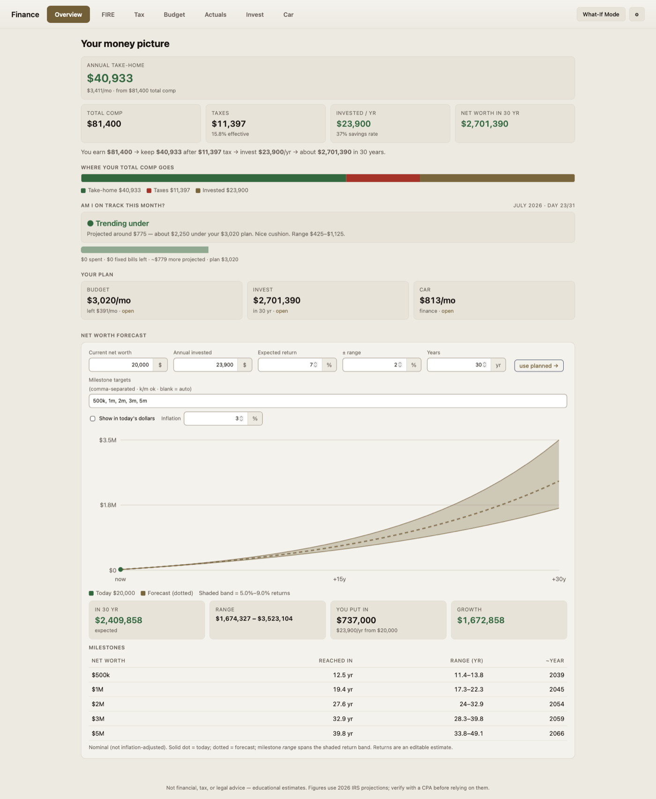
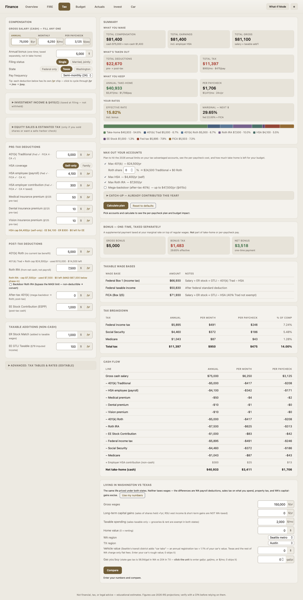
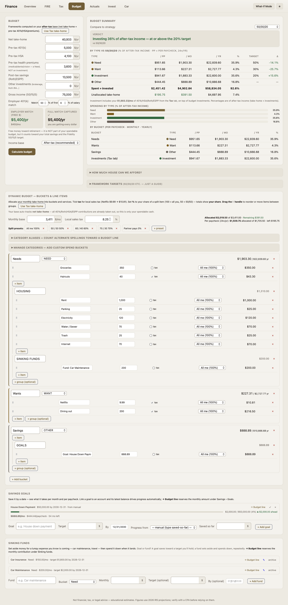
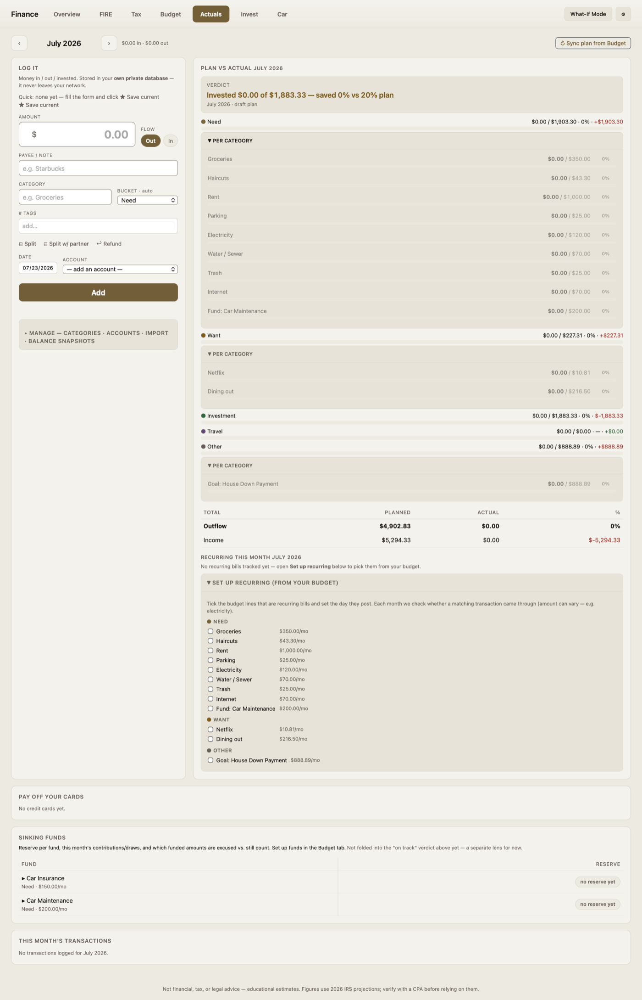
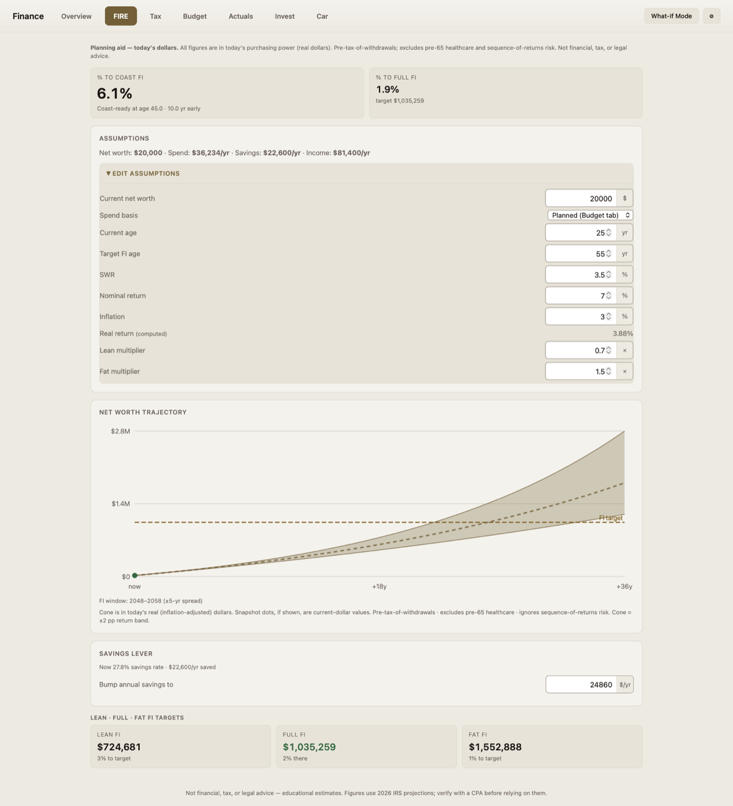

# Finance Tracker — a Home Assistant add-on

A self-hosted household finance app that runs entirely inside Home Assistant: tax
planning (Federal + TX/CA/WA), budgeting, real spending vs. plan, sinking funds,
FIRE projections, and — since 0.3.0 — a per-HA-login profile for every household
member. FastAPI + SQLite live inside the add-on's own private `/data` volume;
there's no external service, no signup, and no ports exposed to your network. Open
**Finance** in the HA sidebar and everything runs behind your existing HA login.

> **Not financial, tax, investment, or legal advice.** All figures are planning
> estimates. Consult a licensed CPA, CFP, or attorney before making financial
> decisions.

---

## Screenshots

*Overview — net-worth forecast, spending pace vs. plan this month.*

*Tax — Federal + state take-home breakdown, Single and MFJ.*

*Budget — 50/30/20 breakdown, custom categories, sinking funds.*

*Actuals — the transaction ledger, with the single Filter control.*

*FIRE — Coast FIRE hero number, years-to-FI bands, savings-rate lever.*

<!-- Future candidates: Settings (theme picker), a mobile/phone-width shot. -->

---

## Install

1. In Home Assistant: **Settings → Add-ons → Add-on Store → ⋮ (top right) → Repositories.**
2. Add `https://github.com/RR-AMATOK/ha-addons` and close the dialog.
3. **Finance Tracker** appears in the store — install it. The image builds on the
   device from the bundled Dockerfile (a few minutes on a Home Assistant Yellow).
4. Start it, enable the **Watchdog** toggle, and open **Finance** in the sidebar.

Updates arrive through the normal **Check for updates** flow whenever a new version
is published to this repository.

---

## What's inside

Seven tabs, one consistent take-home number feeding all of them:

- **Overview** — net-worth forecast, spending pace vs. plan this month, compensation flow.
- **Tax** — Federal + TX / CA / WA / no-state-tax, Single and Married Filing Jointly,
  payroll deductions (401k, HSA, premiums), ESPP/RSU dispositions, a max-out
  contribution planner, and a WA-vs-TX cost-of-living compare.
- **Budget** — 50/30/20 (and other frameworks) on your after-tax income, custom
  categories, savings goals, a house-affordability planner, **sinking funds** for
  irregular expenses (car maintenance, travel — reserve monthly, draw against it
  when the expense hits), and **What-If Mode** (edit the real UI hypothetically,
  see live deltas, save or activate the plan).
- **Actuals** — log real transactions against the plan; a single **Filter** control
  for tag/card/category (replacing a wall of chips); per-credit-card running
  balance with earmarked payments; CSV/Excel import; full backup/restore.
- **Invest** — next-dollar savings waterfall, Roth/backdoor guidance, an
  investment-accounts registry, and a venture ROI tracker for self-investments.
- **Car** — lease vs. finance, total cost of ownership, buy-vs-lease crossover.
- **FIRE** — Coast FIRE hero number, years-to-FI bands, a savings-rate lever, and
  Lean/FI/Fat variants.

**Multi-user, per household login (since 0.3.0):** every Home Assistant user who
opens the panel gets their own transactions, accounts, budget, goals, and tax
inputs, synced to their profile instead of one shared dataset. If one person has
more than one HA login, **linked accounts** (Settings → Linked accounts, since
0.3.2) join them into a single profile with a one-time code. The household's
**owner** seat (whoever opened Finance first) can be handed to someone else any
time via **Transfer ownership** (since 0.3.1).

The add-on ships with a warm light theme plus dark and accent variants (picker in
Settings, since 0.2.0). It does **not** read your Home Assistant theme at runtime —
that would require an HA API grant this add-on deliberately never takes; the
bundled theme is converted from a real HA theme at build time instead.

---

## Security posture

- **Ingress-only.** No `ports:` are published — the only way in is Home
  Assistant's authenticated ingress proxy (your HA login, including 2FA).
- **No Home Assistant API access.** The add-on cannot read HA Core, the recorder
  database, or any other add-on's data — it has no `homeassistant_api` grant.
- **No host directories are mapped.** The add-on can't see `/config`; it has only
  its own private `/data` volume.
- **Your data never leaves `/data`.** Nothing is sent to any external server. HA's
  native backups cover it automatically (`backup: cold` — the add-on pauses
  briefly during a backup so the SQLite copy is always consistent).
- **Per-user profiles carry owner guards.** Restoring a backup, downloading the
  full/Actuals backups, and exporting CSV are restricted to the household owner;
  other members get a clear refusal if they try those actions.

---

## Documentation

Full usage detail — every setting, the multi-user model, backup/restore, and the
security invariants that govern future versions — lives in the add-on's own
**Documentation** tab inside Home Assistant, or read it directly:
[`DOCS.md`](https://github.com/RR-AMATOK/ha-addons/blob/main/finance_tracker/DOCS.md)
in this repo. Release history: [`CHANGELOG.md`](https://github.com/RR-AMATOK/ha-addons/blob/main/finance_tracker/CHANGELOG.md).

---

## A note on maintenance

This is a personal project built and run by one person for their own household —
it's evolving fast (see the changelog) and isn't backed by a support team. It's
shared publicly because the add-on repository format requires it and because it
might be useful to someone else. Issues and PRs are welcome but responses may be
slow; there's no roadmap commitment beyond what the changelog already shipped.
